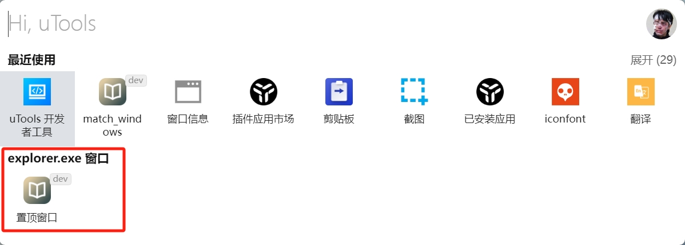

# uTools智能匹配示例 - 窗口匹配


## 运行示例插件
```
1. 打开[uTools] - [插件应用市场]
2. 安装并打开[uTools 开发者工具]
3. 新建项目
4. 选择utools-match-windows-example下的plugin.json
5. 运行
6. windows下打开[文件夹, 微信, 飞书, vsCode, 网易云音乐, Edg浏览器]任一窗口再呼出uTools观察第二栏匹配上了该插件
```

## 窗口智能匹配界面


## 添加更多的窗口匹配
1. 打开要匹配的窗口, 比如vscode
2. 打开uTools, 检索窗口信息, 打开窗口信息插件
3. 复制应用的值例如：Code.exe
4. plugin.json添加应用
```json
  "features": [
    {
      "code": "xxx",
      "explain": "xxx",
      "cmds": [
        "xxx",
        {
          "match": {
            "app": [
              // 添加到这
              "Code.exe"
            ]
          }
        }
      ]
    }
  ]
```